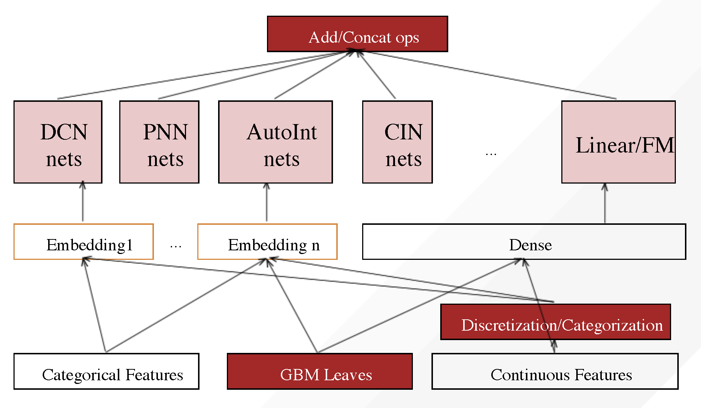

Welcome to DeepTables
=====================

DeepTables: Deep-learning Toolkit for Tabular data
##################################################

DeepTables(DT) is a easy-to-use toolkit that enables deep learning to unleash great power on tabular data.

Overview
########

MLP (also known as Fully-connected neural networks) have been shown inefficient in learning distribution representation. The “add” operations of the perceptron layer have been proven poor performance to exploring multiplicative feature interactions. In most cases, manual feature engineering is necessary and this work requires extensive domain knowledge and very cumbersome. How learning feature interactions efficiently in neural networks becomes the most important problem.

A lot of models have been proposed to CTR prediction and continue to outperform existing state-of-the-art approaches to the late years. Well-known examples include FM, DeepFM, Wide&Deep, DCN, PNN, etc. These models can also provide good performance on tabular data under reasonable utilization.

DT aims to utilize the latest research findings to provide users with an end-to-end toolkit on tabular data.

DT has been designed with these key goals in mind:

* Easy to use, non-experts can also use.
* Provide good performance out of the box.
* Flexible architecture and easy expansion by user.

DT follow these steps to build a neural network:

1. Category features sent to embedding layers.
2. Continuous feature sent to dense layer or to embedding layers after discretization/categorization.
3. Embedding/Dense layers output to various network components.
4. Different network components are fused through add/concat operation as the output of the model.

Why use DeepTables?
###################

- Free preprocessing and processing.

  * Easy to expert data scientist or a business analyst without modeling ability.
  * Simpler than the traditional machine learning algorithm which highly depends on manual feature engineering.

- Excellent performance out of the box.

  * Builtin a group of neural network components (NETs) from the most excellent research results in recent years.

- Extremely easy to use.

  * Only 5 lines of code can complete the modeling of any data set.

- Very open architecture design.

  * supports plug-in extension.

Example
#######

.. include:: example.txt

.. toctree::
   :maxdepth: 2
   :caption: Home:

   Quick-Start<quick_start.md>
   Examples<examples.md>
   ModelConfig<model_config.md>
   Models<models.md>
   Layers<layers.md>
   API<modules.rst>
   FAQ<faq.md>

Indices and tables
==================

* :ref:`genindex`
* :ref:`modindex`
* :ref:`search`
