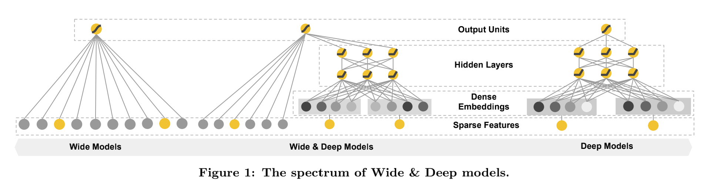
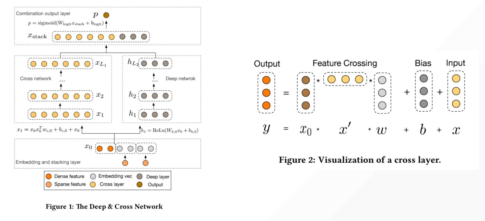
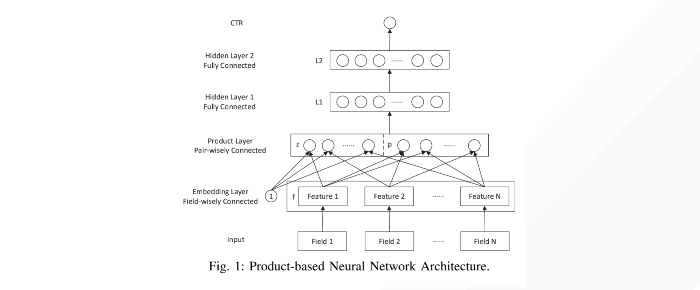
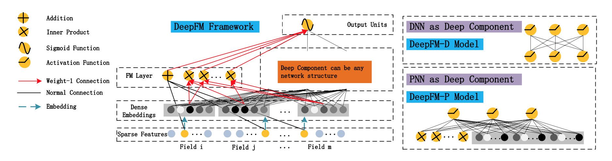
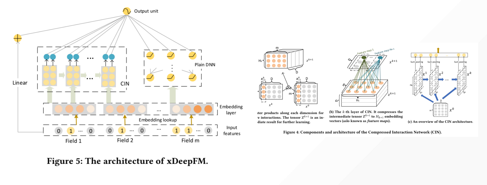
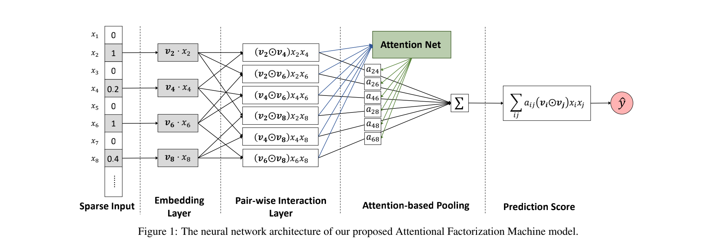
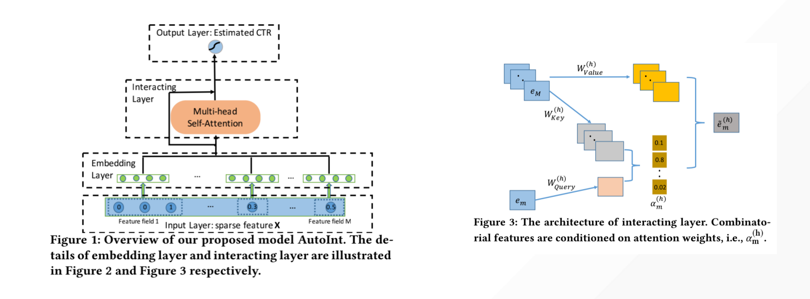
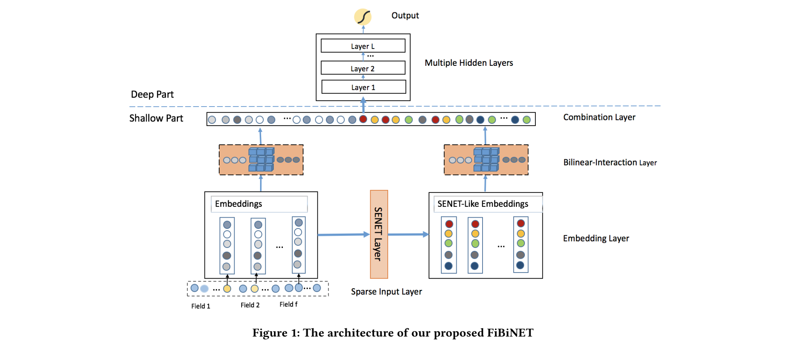
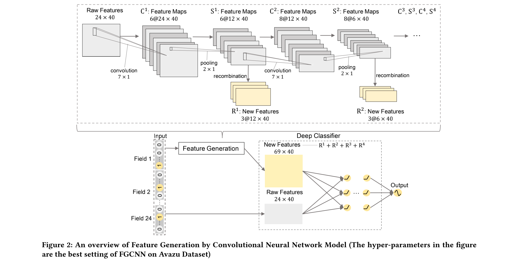

# Models

In recent years, a lot of neural nets have been proposed to CTR prediction and continue to outperform existing state-of-the-art approaches. Well-known examples include FM, DeepFM, Wide&Deep, DCN, PNN, etc. DT provides most of these models and will continue to introduce the latest research findings in the future.

## Wide&Deep

Cheng, Heng-Tze, et al. "Wide & deep learning for recommender systems." Proceedings of the 1st workshop on deep learning for recommender systems. 2016.

**Retrieve from**: [https://dl.acm.org/doi/abs/10.1145/2988450.2988454](https://dl.acm.org/doi/abs/10.1145/2988450.2988454)

> Wide & Deep learning—jointly trained wide linear models and deep neural networks—to combine the benefits of memorization and generalization for recommender systems. We productionized and evaluated the system on Google Play, a commercial mobile app store with over one billion active users and over one million apps. Online experiment results show that Wide & Deep significantly increased app acquisitions compared with wide-only and deep-only models.

## DCN(Deep & Cross Network)

Wang, Ruoxi, et al. "Deep & cross network for ad click predictions." Proceedings of the ADKDD'17. 2017. 1-7.

**Retrived from**: [https://dl.acm.org/doi/abs/10.1145/3124749.3124754](https://dl.acm.org/doi/abs/10.1145/3124749.3124754)

>  Deep & Cross Network (DCN) keeps the benefits of a DNN model, and beyond that, it introduces a novel cross network that is more efficient in learning certain bounded-degree feature interactions. In particular, DCN explicitly applies feature crossing at each layer, requires no manual feature engineering, and adds negligible extra complexity to the DNN model.

## PNN

Qu, Yanru, et al. "Product-based neural networks for user response prediction." 2016 IEEE 16th International Conference on Data Mining (ICDM). IEEE, 2016.

**Retrived from**: [https://ieeexplore.ieee.org/abstract/document/7837964/](https://ieeexplore.ieee.org/abstract/document/7837964/)

> Product-based Neural Networks (PNN) with an embedding layer to learn a distributed representation of the categorical data, a product layer to capture interactive patterns between inter-field categories, and further fully connected layers to explore high-order feature interactions.

## DeepFM

Guo, Huifeng, et al. "Deepfm: An end-to-end wide & deep learning framework for CTR prediction." arXiv preprint arXiv:1804.04950 (2018).

**Retrieve from**: [https://arxiv.org/abs/1804.04950](https://arxiv.org/abs/1804.04950)

> DeepFM, combines the power of factorization machines for recommendation and deep learning for feature learning in a new neural network architecture. Compared to the latest Wide & Deep model from Google, DeepFM has a shared raw feature input to both its “wide” and “deep” components, with no need of feature engineering besides raw features. DeepFM, as a general learning framework, can incorporate various network architectures in its deep component. 

## xDeepFM

Lian, Jianxun, et al. "xdeepfm: Combining explicit and implicit feature interactions for recommender systems." Proceedings of the 24th ACM SIGKDD International Conference on Knowledge Discovery & Data Mining. 2018.

**Retrieve from**: [https://dl.acm.org/doi/abs/10.1145/3219819.3220023](https://dl.acm.org/doi/abs/10.1145/3219819.3220023)

>  A novel Compressed Interaction Network (CIN), which aims to generate feature interactions in an explicit fashion and at the vector-wise level. We show that the CIN share some functionalities with convolutional neural networks (CNNs) and recurrent neural networks (RNNs). We further combine a CIN and a classical DNN into one unified model, and named this new model eXtreme Deep Factorization Machine (xDeepFM).

## AFM

Xiao, Jun, et al. "Attentional factorization machines: Learning the weight of feature interactions via attention networks." arXiv preprint arXiv:1708.04617 (2017).

**Retrieve from**: [https://arxiv.org/abs/1708.04617](https://arxiv.org/abs/1708.04617)

> Attentional Factorization Machine (AFM), which learns the importance of each feature interaction from data via a neural attention network. Extensive experiments on two real-world datasets demonstrate the effectiveness of AFM. Empirically, it is shown on regression task AFM betters FM with a 8.6% relative improvement, and consistently outperforms the state-of-the-art deep learning methods Wide&Deep and DeepCross with a much simpler structure and fewer model parameters. 

## AutoInt

Song, Weiping, et al. "Autoint: Automatic feature interaction learning via self-attentive neural networks." Proceedings of the 28th ACM International Conference on Information and Knowledge Management. 2019.

**Retrieve from**: [https://dl.acm.org/doi/abs/10.1145/3357384.3357925](https://dl.acm.org/doi/abs/10.1145/3357384.3357925)

>  AutoInt can be applied to both numerical and categorical input features. Specifically, we map both the numerical and categorical features into the same low-dimensional space. Afterwards, a multihead self-attentive neural network with residual connections is proposed to explicitly model the feature interactions in the lowdimensional space. With different layers of the multi-head selfattentive neural networks, different orders of feature combinations of input features can be modeled. The whole model can be efficiently fit on large-scale raw data in an end-to-end fashion.

## FiBiNet

Huang, Tongwen, Zhiqi Zhang, and Junlin Zhang. "FiBiNET: combining feature importance and bilinear feature interaction for click-through rate prediction." Proceedings of the 13th ACM Conference on Recommender Systems. 2019.

**Retrieve from**: [https://dl.acm.org/doi/abs/10.1145/3298689.3347043](https://dl.acm.org/doi/abs/10.1145/3298689.3347043)

> FiBiNET as an abbreviation for Feature Importance and Bilinear feature Interaction NETwork is proposed to dynamically learn the feature importance and fine-grained feature interactions. On the one hand, the FiBiNET can dynamically learn the importance of features via the Squeeze-Excitation network (SENET) mechanism; on the other hand, it is able to effectively learn the feature interactions via bilinear function.

## FGCNN

Liu, Bin, et al. "Feature generation by convolutional neural network for click-through rate prediction." The World Wide Web Conference. 2019.

**Retrieve from**: [https://dl.acm.org/doi/abs/10.1145/3308558.3313497](https://dl.acm.org/doi/abs/10.1145/3308558.3313497)

> Feature Generation by Convolutional Neural Network (FGCNN) model with two components: Feature Generation and Deep Classifier. Feature Generation leverages the strength of CNN to generate local patterns and recombine them to generate new features. Deep Classifier adopts the structure of IPNN to learn interactions from the augmented feature space. Experimental results on three large-scale datasets show that FGCNN significantly outperforms nine state-of-the-art models. Moreover, when applying some state-of-the-art models as Deep Classifier, better performance is always achieved, showing the great compatibility of our FGCNN model. This work explores a novel direction for CTR predictions: it is quite useful to reduce the learning difficulties of DNN by automatically identifying important features.

