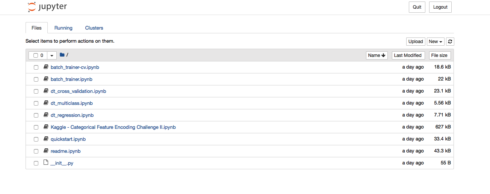

# Quick-Start

## Installation Guide

### Requirements
**Python 3**: DT requires Python version 3.6 or 3.7. 

**Tensorflow** >= 2.0.0: DT is based on TensorFlow. Please follow this [tutorial](https://www.tensorflow.org/install/pip) to install TensorFlow for python3.


### Install DeepTables

```shell script
pip install deeptables
```

**GPU** Setup (Optional): If you have GPUs on your machine and want to use them to accelerate the training, you can use the following command.
```shell script
pip install deeptables[gpu]
```
                     
***Verify the install***:
```shell script
python -c "from deeptables.utils.quicktest import test; test()"
```

### Launch a DeepTables Docker Container
You can also quickly try DeepTables through the [Docker](https://docs.docker.com/get-docker/):

1. Pull a DeepTables image (optional).
2. Launch Docker container.

Pull the latest image:
```
docker pull datacanvas/deeptables-example
```

Then launch Docker container with this command line:
```bash
docker run -it -p 8830:8888 -e NotebookToken="your-token"  datacanvas/deeptables-example
```

The value "your-token" is a user specified string for the notebook and can be empty.

As a result, notebook server should be running at: [https://host-ip-address:8830?token=your-token](https://host-ip-address:8830?token=your-token)
Launch a browser and connect to that URL you will see the Jupyter Notebook like this:


## Getting started: 5 lines to DT

### Supported Tasks
DT can be use to solve **classification** and **regression** prediction problems on tabular data.

### Simple Example
DT supports these tasks with extremely simple interface without dealing with data cleaning and feature engineering. You don't even specify the task type, DT will automatically infer.
```
from deeptables.models.deeptable import DeepTable, ModelConfig
from deeptables.models.deepnets import DeepFM

dt = DeepTable(ModelConfig(nets=DeepFM))
dt.fit(X, y)
preds = dt.predict(X_test)
```


## Datasets

DT has several build-in datasets for the demos or testing which covered binary classification, multi-class classification and regression task. All datasets are accessed through `deeptables.datasets.dsutils`. 

### Adult 
Associated Tasks: **Binary Classification**

Predict whether income exceeds $50K/yr based on census data. Also known as "Census Income" dataset.
```python
from deeptables.datasets import dsutils
df = dsutils.load_adult()
```
See: [http://archive.ics.uci.edu/ml/datasets/Adult](http://archive.ics.uci.edu/ml/datasets/Adult)

### Glass Identification
Associated Tasks: **Multi-class Classification**

From USA Forensic Science Service; 6 types of glass; defined in terms of their oxide content (i.e. Na, Fe, K, etc)
```python
from deeptables.datasets import dsutils
df = dsutils.load_glass_uci()
```
See: [http://archive.ics.uci.edu/ml/datasets/Glass+Identification](http://archive.ics.uci.edu/ml/datasets/Glass+Identification)

### Boston house-prices
Associated Tasks: **Regression**
```python
from deeptables.datasets import dsutils
df = dsutils.load_boston()
```

See: [https://scikit-learn.org/stable/modules/generated/sklearn.datasets.load_boston.html](https://scikit-learn.org/stable/modules/generated/sklearn.datasets.load_boston.html)

### Examples
See: [Examples](https://deeptables.readthedocs.io/en/latest/examples.html)

